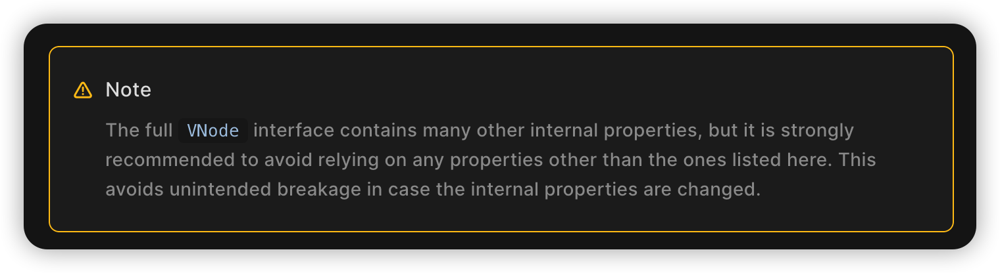
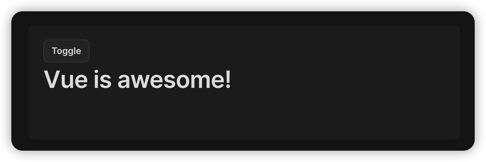

# 目标

必须完成

-   将 [Vue3 文档](https://github.com/vuejs/docs) 转换为 Dendron Vault
    -   将文件名、文件组织结构转换为 [扁平目录](#dendron)
    -   将文件中的 [文件引用链接](#vue3) 转换为 [双向链接](#dendron-1)
    -   将所有图片链接移动到

以下内容需要深入 [vue3 文档 vite press 配置](https://github.com/vuejs/vitepress)，因此为可选任务

-   更改 [admonitions](#markdown-文件中的内容) 为 `> ${content}`
-   移除 [vue component](#markdown-文件中的内容) 代码

以下内容欠缺执行细节，因此为待计划任务

-   支持同步源文档仓库，自动执行转换，并支持配置
    ```json
    // package.json
    {
        "my-package-name": {
            // "watch": false
            "watch": {
                "targetURL": "https://github.com/vuejs/docs/tree/main/src", // 待转换文档所在目录
                "triggerTransform": "onMajorVersionChange", // 当版本变化时执行转换任务，例如 3.2 → 3.3
                "notification": true // 执行完转换任务后发送邮件通知
            }
        }
    }
    ```
-   支持使用配置文件配置转换功能
    ```json
    // package.json
    {
        "my-package-name": {
            // "transform": false
            "transform": {
                "exclude": "", // 不进行处理的文档
                "prefix": "", // 为最终转化的后文件名添加前缀
                "preset": [ // 指定待转化的文档类型
                    "vue3": { //
                        "linkToWikilink": true, // 转化 markdown link 为 wikilink
                        "assetsPath": "" // 指定图片、pdf 等外部文件的存储位置
                    }
                ]
            }
        }
    }
    ```

# 索引

## 文档结构及引用方法

### 基础

一般情况下，开源文档按照不同分类组织文档，单个文件夹表示一个分类，例如

```bash
-- a
---- c.md
-- b
---- d.md
```

在 d.md 中引用 c.md

```md
<!-- d.md -->

[c](../a/c.md)
```

### Dendron

使用 Dendron 时，不使用文件夹表示分类，文件本身即分类，使用文件名作为分类依据。例如

```bash
-- a.md
-- a.b.md
-- c.md
-- c.d.md
```

在 c.d.md 中引用 a.b.md

```md
<!-- c.d.md -->

[[a.b.md]]
```

## Markdown 文件中的链接

### 基础

|              | 形式                 | 备注                     |
| ------------ | -------------------- | ------------------------ |
| 文本链接     | `https://a.com`      |
| 本地文档链接 | `[c](/a/c.md)`       |
| 本地图片链接 | ``    | image 路径视具体情况而定 |
| 外部链接     | `[a](https://a.com)` |

### Dendron

在 [基础](#基础) 之上，dendron 拓展了以下链接

|                      | 形式                     | 备注                                                      |
| -------------------- | ------------------------ | --------------------------------------------------------- |
| 双向链接             | `[[a]]`                  |
| dendron 本地图片链接 | `` | 注意 dendron 中的图片一般放在相对于文档的 `assets` 目录中 |

### Vue3

[Vue3 文档](https://github.com/vuejs/docs) 在 [基础](#基础) 之上，拓展了以下链接

|           | 形式             | 备注                                                                        |
| --------- | ---------------- | --------------------------------------------------------------------------- |
| html 链接 | `[c](/a/c.html)` | Vue3 文档中，不使用指向 md 文件的链接，而使用部署后该文件对应 HTML 所在路由 |

## Markdown 文件中的内容

此前着重讲了 [文件中的链接](#markdown-文件中的链接)，接下里介绍下文件中的其他内容，主要包括

1. [CommonMark](https://commonmark.org/) 不支持的 markdown 语法
2. 非标准的 HTML Tag

### Vue

[Vue3 文档](https://github.com/vuejs/docs) 使用 [vitepress](https://github.com/vuejs/vitepress) 构建文档，拓展了以下语法

-   [admonitions](https://vuejs.org/guide/introduction.html#what-is-vue) 
    ```md
    :::warning Note
    The full VNode interface contains many other internal properties, but it is strongly recommended to avoid relying on any properties other than the ones listed here. This avoids unintended breakage in case the internal properties are changed.
    :::
    ```
-   [vue component](https://vuejs.org/guide/essentials/conditional.html#v-else) 

    ````md
    <script setup>
    import { ref } from 'vue'
    const awesome = ref(true)
    </script>

    ```vue-html
    <h1 v-if="awesome">Vue is awesome!</h1>
    ```
    ````
